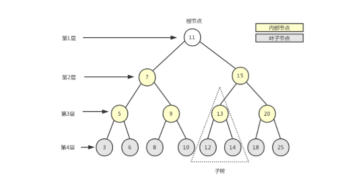

# 树🌲

## 定义结点

树是一种常见的非线性结构，下图就是一个二叉树（二叉树最多有两个子节点），二叉树是数中最常见的，也是我们要介绍的。


树最顶部的结点叫做**根节点**（11），黄色部分为内部结点，灰色部分为**叶子节点**，叶子结点没有下级结点。

以下是树的存储结构：


每一个结点都保存在一个对象中，这个结点的左右结点指向另一个子节点，以此类推。

定义结点

```js
function BinarySearchTree() {
    function Node(key) {
        this.key = key;
        this.left = null;
        this.right = null;
    }
    this.root = null;
}

```

## 方法

### 1. insert(key): 插入

```js
BinarySearchTree.prototype.insert = function (key) {
    var node = new Node(key);
    if (this.root == null) {
        this.root = node;
    } else {
        this.insertSearch(this.root,node)       
    }
}

// 内部方法：插入结点
BinarySearchTree.prototype.insertSearch = function (node, newNode) {
    if (node.key > newNode.key) {
        if (node.left == null) {
            node.left = newNode
        } else {
            insertSearch(node.left, newNode)
        }
    } else {
        if(node.right == null){
            node.right = newNode
        }else{
            insertSearch(node.right, newNode)
        }
    }
}
```

如何使用哦？

```js
var tr = new BinarySearchTree();
tr.insert(5)
tr.insert(6)
tr.insert(4)

console.log(tr.root)
// Node {
//   key: 5,
//   left: Node { key: 4, left: null, right: null },
//   right: Node { key: 6, left: null, right: null }
// }
```

返回如下的结构，它对应：

``` 
   5
  /	\
 4   6
```


### 2. search(key)：查找

```js

```


### 3. inOrderTraverse: 中序遍历

中序遍历是，遍历循序是： **左节点 子节点 右节点**

比如上面举例的树的遍历循序是： 4 5 6

```js
BinarySearchTree.prototype.inOrderTraverse = function (callback) {
    this.inOrderTraverseNode(this.root,callback)
}

// 内部方法
BinarySearchTree.prototype.inOrderTraverseNode = function(node,callback){
    if(node != null){
        this.inOrderTraverseNode(node.left,callback);
        callback(node.key)
        this.inOrderTraverseNode(node.right,callback)
    }
}
```

使用：

```js
var tr = new BinarySearchTree();
tr.insert(5)
tr.insert(6)
tr.insert(4)
tr.insert(3)
tr.insert(2)

console.log(tr.root)

tr.inOrderTraverse((data)=>{
    console.log(data)
    // 2 3 4 5 6
})
```

图解如下：

```
 			5
 		   / \
 		  4   6
 		 / \ 
 		2   3
```


### 4. porOrderTraverse: 先序遍历

```js

```


### 5. postOrderTraverse: 后续遍历

