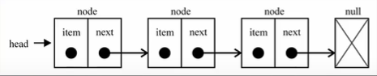

### 🔗链表 

数组是一段连续的空间，所以大小固定，不能满足容量需求时扩容很消耗性能。

数组的缺点就是链表的优点，可以无限扩展（内存不满）。插入删除性能很高复杂度（O(1)）。



### 1. 封装 

#### 1) 创建链表结构


```js
function LinkedList() {
    function Node(data) {
        this.data = data;
        this.next = null;
    }
    this.head = null;
    this.length = 0;
}
```

#### 2) 添加

首先判断链表是否为空，要是为空的话直接将新生成的元素添加到head上，如果不为空创建一个新变量保存头结点循环判断这个结点的next域为空为止。找到这个空结点将创建的结点保存到这里。

```js

LinkedList.prototype.append = function (elment) {
        if (this.head === null) {
            this.head = new Node(elment)
        } else {
            var current = this.head;
             while(current){
                current = current.next;
            }
            current.next = new Node(elment)
        }
    }
```

#### 3) toString方法

```js


```

