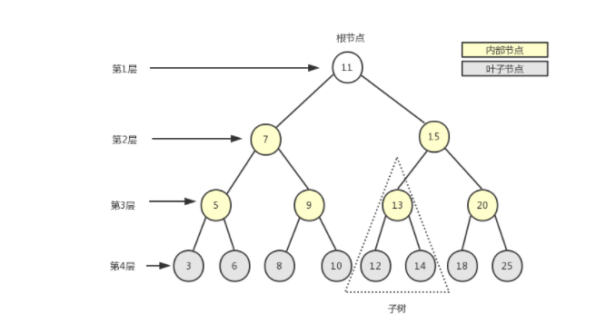
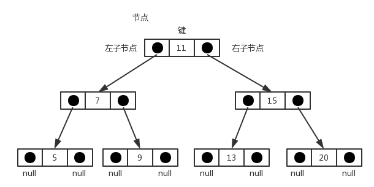

# 树🌲
树是一种常见的非线性结构，下图就是一个二叉树（二叉树最多有两个子节点），二叉树是数中最常见的，也是我们要介绍的。


树最顶部的结点叫做**根节点**（11），黄色部分为内部结点，灰色部分为**叶子节点**，叶子结点没有下级结点。

以下是树的存储结构：


每一个结点都保存在一个对象中，这个结点的左右结点指向另一个子节点，以此类推。

1. 定义结点

```js
function BinarySearchTree() {
    function Node(key) {
        this.key = key;
        this.left = null;
        this.right = null;
    }
    this.root = null;

    BinarySearchTree.prototype.insert = function (key) {
        var node = new Node(key);
        if (this.root == null) {
            this.root == key
        } else {
            insertSearch(node,newNode)       
        }

    }


    // 插入结点
    BinarySearchTree.prototype.insertSearch = function (node, newNode) {
        if (node.key > newNode.key) {
            if (node.left == null) {
                node.left = newNode
            } else {
                insertSearch(node.left, newNode)
            }
        } else {
            if(node.right == null){
                newNode.right == newNode
            }else{
                insertSearch(node.right, newNode)
            }
        }
    }
}

```


2. 方法：

- insert(key): 插入
- search(key)：查找
- inOrderTraverse: 中序遍历
- porOrderTraverse: 先序遍历
- postOrderTraverse: 后续遍历

