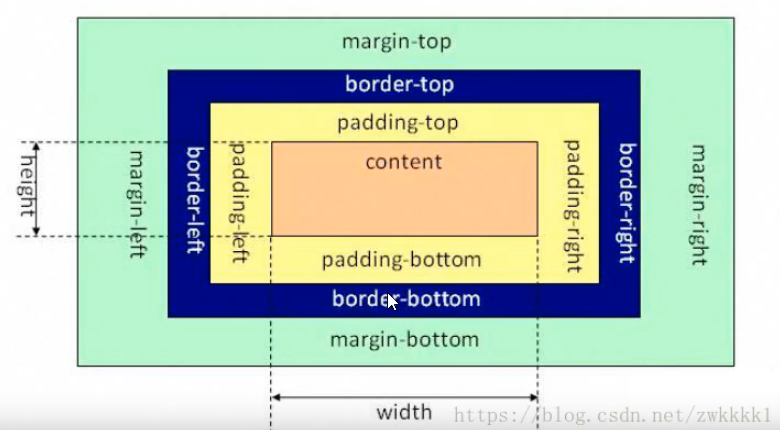
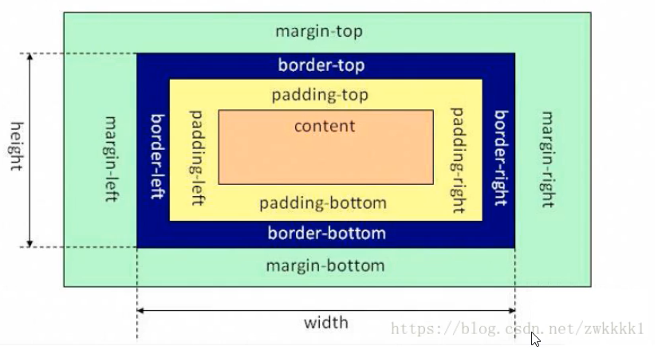
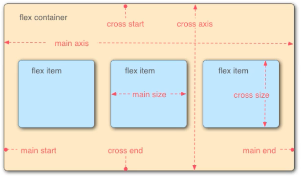

# 标准盒模型


## 1 标准和模型

标准盒模型中宽高为 content 的宽度。



不过 css 中 box-sizing 属性可以改变宽高计算范围。

`box-sizing: content-box | border-box;`

`box-sizing` 有两个属性值，`content-box` 为默认值，当属性值为 `border-box` 时，宽度的计算方式如下：

```
width = content-height + border-left + border-right 
height = content-width + border-top + border-bottom 
```

## 2 IE盒模型



## 3 FLEX盒模型
