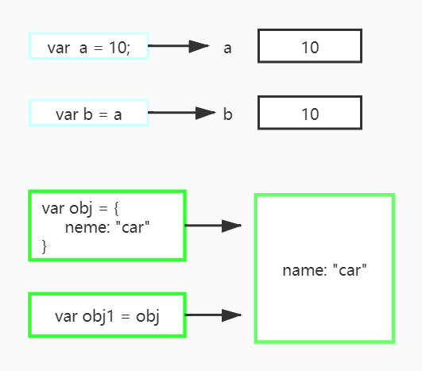

## 数据类型

首先 JavaScript 中的数据分为两大类：**基本数据**类型和**引用数据**类型。

为什么这么分？ 因为引用数据存在于堆中，而基本数据存在于栈中，看着一段代码:

```js
// 基本类型数据
var a = 10;
var b = a;
a = 11
console.log(a)	// 11
console.log(b)  // 10

// 引用数据
var obj = {
    name: "car"
}

var obj1 = obj;
boj1.name = "flane"
console.log(obj.name) // flane
```

基本类型数据（上面的数组）中的赋值的时候，传入的是实际值，而引用数据赋值传入指针，看看下图。



### 基本数据类型

- Number（数字）
- String（字符串）
- Boolean（布尔）

#### 数字


### 引用数据类型