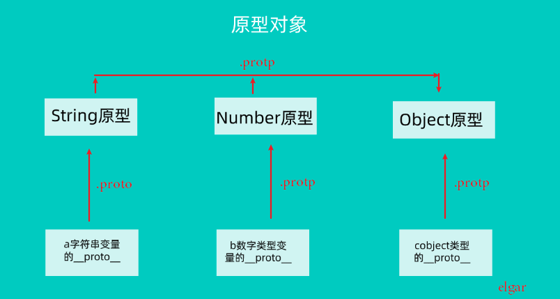

## 数据类型

✅ 基本数据类型
✅ 引用数据类型
✅ 包装类型

首先 JavaScript 中的数据分为两大类：**基本数据**类型和**引用数据**类型。

为什么这么分？ 因为基本类型数据（上面的数组）中的赋值的时候，传入的是实际值，而引用数据赋值传入指针，看下图理解，引用类型没有复制真正的值，而是两个变量执行同一个内存空间，所以上面的 `obj1.name` 改变 `obj.name` 也一起改变。
引用数据存在于堆中，而基本数据存在于栈中。

```js
// 基本类型数据
var a = 10;
var b = a;
a = 11
console.log(a)	// 11
console.log(b)  // 10

// 引用数据
var obj = {
    name: "car"
}

var obj1 = obj;
boj1.name = "flane"
console.log(obj.name) // flane
```


### 基本数据类型

- Number（数字）
- String（字符串）
- Boolean（布尔）
- undefined
- null
- symbol(ES2016新增)
- bigint(数字类型)

如何判断基本数据类型?

JS 提供了 typeof 方法来判断基本数据类型，typeof 能判断六种类型的数据：
number, boolean, string, undefined, object, function。

typeof 有两种写法,推荐只用带括号的写法：
```js
var a = null;
typeof(a);  // "object" 推荐
typeof a;   // "object"

typeof (1);   // "number"
typeof (NaN)  // "number"

typeof ("123");    // "string"

typeof (true);  	//"boolean"

typeof (undefined);   //"undefined"

typeof ({});  // "object"

typeof ([]);    // "object"

typeof (null);  // "object" null 给对象占位

function foo(){}
typeof (foo);   //  "function"

var sym = Symbol("foo");
typeof (sym); // "symbol"
```

注意：用 typeof null 返回的是 "object"。

### 引用数据类型

- Object
- Array
- Date
- RegExp
- Function

这些事引用数据类型，最重要的一点是**不能直接复制**。要想复制引用类型的数据需要自己写一个函数，这函数在后面会详细讲解（深拷贝）。

如何判断引用数据类型？


### 包装类型

- Boolean
- Number
- String

你是否注意到这样一个现象，数字类型怎么会有 toString 方法。

```js
var a = 1;
a.toString()  // "1"
```

这是因为当你给数字执行方法是 JS 内部会创建一个引用类型的数数据，之后执该方法后销毁引用类型，上面的语句会这样执行：
```js
var a = new Number(1);
a.toString();   // "1" 之后销毁这个 a 
```

用 new 关键字定义的数字类型具有对象的属性和方法：

```js
var num = new Number(1);
var num1 = 10;

typeof (num);   // "object"
typeof (num1);  // "number"

num.name = "number";
num1.name = "number1";

console.log(num.name)   // "nubmber"
console.log(num.name)   // undefined
```


上图所示，用 new 创建的数字有一个 `__proto__` 的属性，它指向 Number 原型，而 Number 也有个`__proto__` 的属性，指向 Object, 这就是数字有 toString 方法的原因。