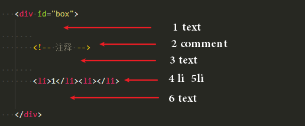

## DOM 节点的操作

### 1、创建 DOM 结点

- document.createDocumentFragment()
- document.createElement("name")
- document.createTextNode("text")

创建一个新的空白的文档片段

```js
// 创建文档偏片段
var fra = document.createDocumentFragment()

// 创建两个li元素
var li = document.createElement("li")
var li1 = document.createElement("li")

// 创建文本结点
var text = document.createTextNode("hello js")

// li元素添加中添加文本
li.appendChild(text)

// fra 添加 li，li1  结点
fra.appendChild(li)
fra.appendChild(li1)
```

这是最后的 fra 片段：
```html
<li>hello js</li>
<li></li>
```


### 2、添加，移除，替换，插入

- appendChild(node)
- removeChild(node)
- replaceChild(new,old)
- insertBefore(new,old)

```js
// 创建文档偏片段
var fra = document.createDocumentFragment();
// 创建两个 li 元素并添加到 fra 中
var li = document.createElement("li")
var li1 = document.createElement("li")
fra.appendChild(li)
fra.appendChild(li1)

// 删除 list 节点中的第一个结点
// fra 片段只剩一个节点 li1
fra.removeChild(fra.childNodes[0]);

// 将创建一个 span 并节点替换成 fra中的 li1 节点: 之后 fra 中只剩一个 span 节点
var span = document.createElement("span")
fra.replace(sapn,fra.childNodes[0])
```

要注意的是 childNodes 是一个保存节点的数组它包括文本节点（text）、注释结点（comment）、文档有元素节点（li,span,div 等），如果两个元素之间紧挨着的，中间不会有文本节点，果如获取 js 下图 div 元素列表会有以下六个节点，数组为： [text, comment, text, li, li, text]



### 3、查找

- document.getElementById("idName")
- getElmentsByName("name")
- getElmentsByClassName("names")
- document.getElementsByTagName("name")
- document.querySelector("name")
- document.querySelectorAll("name")


具体操作看这些例子，注意下一些细节，有些是 Element, 有些是 Elements，带 s 的代表多个，所以是数组

```html
<div id="box">
    <ul>
        <li  name = "list">1</li>
        <li name = "list">2</li>
        <li  name = "list">3</li>
    </ul>
</div>
```

```js
// 通过 id 获取元素（兼容 ie6+）
var div =   document.getElementById("box")

// 通过 name 获取元素，获取三个 li 元素（兼容 ie6+）
var ul =   document.getElementsByName("list")

// 获取 class name 为 content 的元素的集合，获取两个 ul
var content = document.getElementsByClassName("content")

// 获取 ul 元素, 通配符选择器获取所有元素
var ul = document.getElementsByTagName("ul")
var dom = document.getElementsByTagName("*")

// 获取id 为 box 的元素，如果有多个，获取第一个
var box = document.querySelector("#box")
// 获取 classname 为 list 的元素
var li = document.querySelector(".list")

// 获取id 为 box 的所有元素，数组
var boxes = document.querySelectorAll("#box")
// 获取 classname 为 list 的所有元素，数组
var lis = document.querySelectorAll(".list")
```


### 4、属性操作

- elment.getAttribute(key)
- settAttribute(key,value)
- hasAttribute(key)
- removeAttribute(key)

```js
// 获取 li 元素的classname
li.ge
tAttribute("class");

// 将 li 元素的 class 改为 lili
li.setAttribute("class","lili");

// 判断是否存在 class 属性
li.hasAttribute("class")	// true

// 删除 class 属性
li.removeAttribute("class")
```

