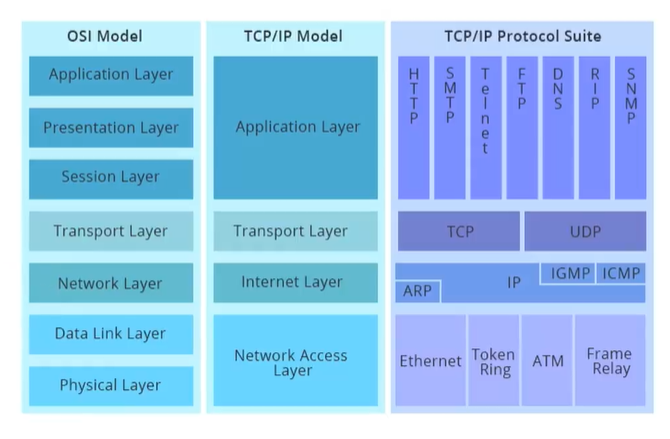

协议栈（protocol stack）

### 应用层

应用层消息称为**报文（message）**。

- HTTP（web文档提供请求传达）

- SMTP（电子邮件协议）
- FTP（文件传输协议）

### 运输层

运输层分组称为**报文段（segment）**

- TCP（面向连接的服务,提供可靠传输）
- UDP（无连接服务）

### 网络层

利用 **IP协议**将**数据报（datagram）** 从一台主机移动到另一台主机上。

### 链路层

链路层分组称为**帧（frame）**

分组一个节点移动到路径的下一个节点, 必须依靠数据链路层的服务

### 物理层

将帧中的数据流(bit) 移动到下一个节点。

一个千兆位以太网链路理论上可以传输十亿比特每秒。

| 原始帧                    | 传输帧                                       |
| ------------------------- | -------------------------------------------- |
| 0001001001001001001000011 | 01111110000100100100100100100001101111110    |
| 0110111111111111111110010 | 01111110011011111011111011111011001001111110 |
| 01111110                  | 0111111001111101001111110                    |

