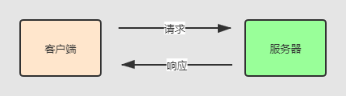
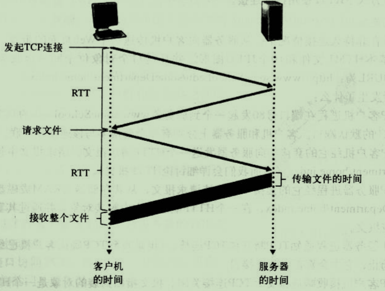
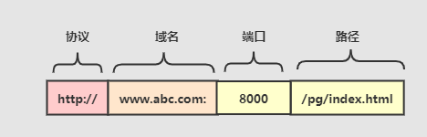
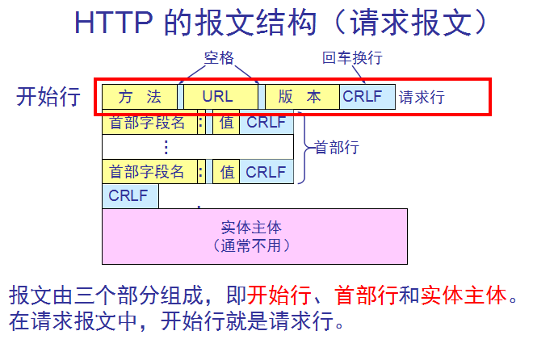

# 应用层


进程（process）

客户机（client）


应用层提供的服务

- 可靠数据传输
- 吞吐量
- 定时
- 安全性


## HTTP

HTTP 使用TCP作为它的支撑运输层协议。

首先要知道客户端发送给服务器的报文叫**请求报文（request message）**。

服务器发送给客户的报文称**响应报文（response message）**。



基本流程：

1. 解析域名(DNS)获取IP地址：先到DNS服务器获取域名对应的ip地址，然后再访问IP。
2. 三次握手建立TCP连接
3. 构造请求头并反送HTTP请求：比如`ajax`,` fatch`等请求	
4. 获取响应，浏览器引擎解析响应，渲染页面，根据超链接发送其他HTTP请求

往返时间（RTT）：分组从客户机到服务器再到客户机所花费的时间。

总的响应时间 = 2RTT + 服务器传输 HTML 的时间。



HTTP由三部分组成，请求行和请求头是必须带的，可以没有请求体。

- 请求行(start-line)：请求头相当于两端的约束，携带HTTP版本，方法等信息 
- 请求头(header-field)：头也携带一些约束，比如目标域名，ip等信息
- 请求体(message-body)：携带传输的数据


URL ： 统一资源定位符



### 请求（request）

请求是由**客户端**(预览网页的用户)发送的请求。



```
GET index.html HTTP/1.1		// 请求行（也叫起始行）
Host: www.abc.com			// 首部行（目标主机） 
Conection:close				// 首部行（连接类型）
User-agent: Mozilla/4.0		// 首部行（用户浏览器类型）
Acsept-language: fr			// 首部行（想要得到数据的语言类型）
```

### 响应（response）

服务器为客户端请求返回的数据。

```
HTTP/1.1 200 OK  		            //响应行
Date: Sun, 01 Oct 2000 23:25:17 GMT  // 头部
Connection: keep-alive    			// 头部（连接类型 持久连接）
Content-length: 12984				// 头部(length) 
Content-Type: text/html				// 头部(数据类型)

<HTML> 								// 内容
<HEAD><TITLE>Hello</TITLE></HEAD> 
<BODY>
Hello world!
</BODY> 
</HTML> 
Connection closed by foreign host.
```


### 方法


GET ：从服务器向客户端发送命名资源 

PUT ：将来自客户端的数据存储到一个命名的服务器资源中去 

DELETE ：从服务器中删除命名资源 

POST ：将客户端数据发送到一个服务器网关应用程序 

HEAD ：仅发送命名资源响应中的 HTTP 首部


### 状态码

每条 HTTP 响应报文返回时都会携带一个状态码。


## FTP

FTP使用TCP作为它的支撑运输层协议。

FTP使用两个并行的TCP连接来传输数据，一个是控制连接，一个是数据连接